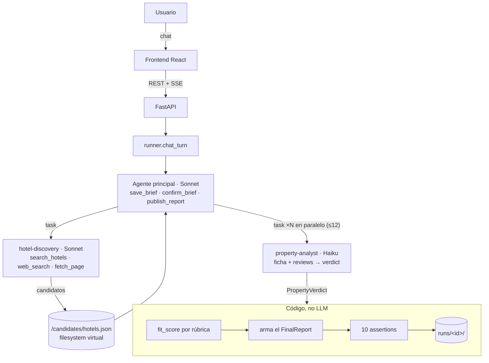

# posta. — deep research de alojamientos

> Contale tu viaje a un agente y te devuelve **todas las opciones que encajan**, justificadas con precios, reviews y
> ubicación verificados en esa misma búsqueda. Nada inventado.

`posta` es un agente conversacional construido con **[deepagents](https://github.com/langchain-ai/deepagents)**
(LangChain / LangGraph). Primero charla con vos hasta armar el *brief* del viaje (destino, fechas, presupuesto,
requisitos, zona) y te pide que lo confirmes. Después investiga: busca candidatos en **Google Hotels (SerpAPI)** y en
la web, lanza hasta **12 analistas en paralelo** (uno por propiedad) y publica un reporte con cada recomendación
respaldada por evidencia.

El foco del proyecto es que **no alucine**. Cada precio y cada dato sale de un resultado de una tool de esa corrida.
El puntaje lo calcula el código, no el modelo, y cada reporte pasa por 10 *assertions* automáticas que lo comparan con
el log de tools.

<p>
  
  
  
  
  
</p>

---

## Contenido

- [Cómo funciona](#cómo-funciona)
- [Decisiones de diseño](#decisiones-de-diseño)
- [Stack](#stack)
- [Puesta en marcha](#puesta-en-marcha)
- [Uso](#uso)
- [Tests y evals](#tests-y-evals)
- [Estructura del repo](#estructura-del-repo)
- [Observabilidad y límites](#observabilidad-y-límites)
- [Limitaciones y próximos pasos](#limitaciones-y-próximos-pasos)

## Cómo funciona



La conversación tiene dos fases, y las dos corren en el **mismo agente**:

1. **Brief.** El agente conversa, va guardando lo que sabe con `save_brief`, sugiere respuestas rápidas y resume.
   **No investiga hasta que confirmás** (`confirm_brief`). Las tools de datos rechazan cualquier llamada sin un brief
   confirmado.
2. **Investigación**, en el mismo turno de la confirmación:
   - `hotel-discovery` busca en Google Hotels y en la web abierta y deja los candidatos, compactos, en el filesystem
     virtual.
   - Hasta 12 `property-analyst` corren en paralelo. Cada uno lee la ficha y las reviews de una propiedad y devuelve un
     `PropertyVerdict` estructurado (Pydantic).
   - El código calcula el puntaje, arma el reporte, lo valida y lo guarda. Todo el progreso llega a la UI por SSE.

**El agente principal nunca ve datos crudos.** Los subagentes tienen contexto aislado y absorben el ruido (JSONs de
SerpAPI, páginas, reviews). Al orquestador solo le llega información compacta.

## Decisiones de diseño

| Principio | En la práctica |
| --- | --- |
| **El LLM decide y redacta; el código calcula y valida** | Precios, puntaje, geometría de zonas (Shapely), links y ensamblado del reporte son código determinista. |
| **Rúbrica fija, no "opinión" del modelo** | Base 50 · +8 por preferencia confirmada (tope +40) · penalización por contra relevante · −25 por red flag · −15 si supera el presupuesto. Si viola un requisito duro, el puntaje queda en ≤ 20 y la propiedad no se recomienda. |
| **Sin evidencia ⇒ `unknown`** | Nada se da por cumplido sin evidencia, y una propiedad solo se descarta con evidencia en contra. |
| **Anti-alucinación en tres capas** | 1) tools que no dejan inventar (por ejemplo, un precio web se rechaza si no aparece literalmente en la página); 2) reglas en los prompts; 3) assertions contra el log de tools. |
| **Los límites viven en el código** | Tope de búsquedas, páginas leídas, analistas, reintentos y fallas por propiedad en [`config.py`](lodging-agent/src/lodging/config.py). Los modelos entran en loops, y un prompt no alcanza para frenarlos. |
| **Degradación elegante** | Si SerpAPI o una página fallan, la tool devuelve un error estructurado, el dato queda `unknown` y la corrida sigue. Si se agota el tiempo, se publica un reporte parcial. |
| **Modelo según la tarea** | Sonnet para orquestar y hacer discovery, Haiku para el trabajo paralelo y acotado de los analistas (configurable por variable de entorno). |

### Las 10 assertions

Cada reporte se valida contra el log de tools de la misma corrida:

`hard_constraints_respected` · `prices_traceable` · `properties_traceable` · `no_verbatim_reviews` · `language` ·
`caps_respected` · `unknowns_classified` · `fit_score_rubric` · `ranking_well_formed` · `zone_respected`

## Stack

- **Agente:** deepagents 0.6, LangGraph (checkpointer `MemorySaver` por hilo, `astream(subgraphs=True)`), LangChain
  Anthropic, structured output con Pydantic v2
- **Datos:** SerpAPI Google Hotels (búsqueda, ficha y reviews), web search de Anthropic y lectura de páginas
  (httpx + trafilatura)
- **Geo:** Shapely (zona dibujada en el mapa + buffer)
- **Backend:** FastAPI con Server-Sent Events, asyncio (`contextvar` por hilo y `Semaphore(5)` para SerpAPI)
- **Frontend:** Vite + React 18 + TypeScript, CSS plano y Leaflet para el mapa
- **Tooling:** uv, pytest y ruff; LangSmith para el tracing (opcional)

## Puesta en marcha

Requisitos: [uv](https://docs.astral.sh/uv/) y Node 18+. uv instala Python 3.12 si hace falta.

```bash
git clone https://github.com/Nicopiriz18/posta.git
cd posta/lodging-agent

cp .env.example .env        # completar las claves (ver abajo)
uv sync --group dev         # dependencias de Python
```

| Variable | Requerida | Para qué |
| --- | --- | --- |
| `ANTHROPIC_API_KEY` | ✅ | Modelos Claude y web search |
| `SERPAPI_KEY` | ✅ | Google Hotels (el plan gratuito tiene 250 búsquedas por mes) |
| `LANGSMITH_API_KEY`, `LANGSMITH_TRACING`, `LANGSMITH_PROJECT` | opcional | Trace completo de cada corrida |
| `LODGING_ORCHESTRATOR_MODEL`, `LODGING_DISCOVERY_MODEL`, `LODGING_ANALYST_MODEL` | opcional | Cambiar el modelo de cada rol |

## Uso

### App web (backend + frontend)

```bash
# terminal 1 — backend
uv run uvicorn lodging.api.main:app --reload      # http://localhost:8000

# terminal 2 — frontend
cd frontend && npm install && npm run dev          # http://localhost:5173 (proxea /api)
```

Para servir todo desde el backend: `cd frontend && npm run build` y abrir `http://localhost:8000/`.

**Sin claves ni backend** podés ver el diseño con datos de ejemplo:
`http://localhost:5173/#/t/mock?mock=1` (conversación guionada con búsqueda en vivo y resultados).

### CLI (modo headless)

Se le pasa un brief ya confirmado y el agente investiga sin preguntar:

```bash
uv run python -m lodging.run --brief src/lodging/evals/goldens/palermo_pareja.json      # -v para ver cada llamada al modelo
```

Imprime el progreso (tools, subagentes, verdicts) y el reporte final. Deja los artefactos en `runs/<id>/`:
`brief.json`, `final.json`, `assertions.json`, `messages.json`, `tool_outputs.jsonl` y `events.jsonl`.

### API

El contrato completo (tipos, eventos SSE, errores) está en [`docs/api.md`](lodging-agent/docs/api.md). Resumen:

| Método | Ruta | Descripción |
| --- | --- | --- |
| `GET` | `/api/health` | Estado y claves configuradas |
| `POST` / `GET` | `/api/threads` | Crear / listar conversaciones |
| `GET` / `DELETE` | `/api/threads/{id}` | Detalle (mensajes, brief, reporte) / eliminar |
| `PUT` | `/api/threads/{id}/zone` | Guardar la zona dibujada en el mapa |
| `POST` | `/api/threads/{id}/messages` | Mandar un mensaje (respuesta por SSE) |
| `GET` | `/api/threads/{id}/events` | Stream SSE del hilo |
| `POST` / `GET` | `/api/runs` | Corrida headless con brief confirmado / listar |
| `GET` / `DELETE` | `/api/runs/{id}` · `/api/runs/{id}/events` | Detalle, eliminar y stream |

## Tests y evals

```bash
uv run pytest                        # 72 tests, sin red
uv run ruff check src tests scripts  # lint
```

Los **tests no tocan la red**. Corren el grafo real de LangGraph con modelos falsos guionados y usan fixtures reales
de SerpAPI. Así se prueba el cableado (fases, guards, caps, SSE, zona) de forma determinista.

Las **evals** usan el modelo real contra 3 *goldens* (Palermo en pareja, Río en familia, Madrid para trabajo remoto) y
verifican las propiedades del output con las assertions:

```bash
uv run python -m lodging.evals                                   # corre los goldens (usa red y cupo de SerpAPI)
uv run python -m lodging.evals --from-runs runs/                 # re-valida corridas guardadas, sin red
uv run python -m lodging.evals --analyst-model anthropic:claude-sonnet-5   # matriz Haiku vs Sonnet
```

## Estructura del repo

```
lodging-agent/
├── src/lodging/
│   ├── config.py          # caps, modelos y timeouts: única fuente de verdad
│   ├── schemas.py         # Brief, Candidate, PropertyVerdict, FinalReport, FitRubric, RunEvent
│   ├── runtime.py         # RunContext por hilo: brief, log de tools, eventos, verdicts
│   ├── callbacks.py       # telemetría por llamada al modelo (duración, tokens, reintentos)
│   ├── runner.py          # chat_turn · run_brief (headless) · finalize_report
│   ├── run.py             # CLI
│   ├── agents/            # orquestador, subagentes, prompts, control tools
│   ├── tools/             # SerpAPI (search/details/reviews), web (fetch_page, add_web_candidate), geo
│   ├── api/main.py        # FastAPI + SSE
│   └── evals/             # assertions, goldens y runner de evals
├── tests/                 # pytest con modelos falsos + fixtures de SerpAPI
├── frontend/              # Vite + React + TS (ver frontend/README.md)
├── docs/api.md            # contrato backend ⇄ frontend
└── scripts/validation/    # captura de fixtures reales
```

## Observabilidad y límites

- Cada llamada al modelo emite un evento `model` (duración y tokens), y los errores o reintentos emiten un `warning`.
  Están en `runs/<id>/events.jsonl`, o en consola con `-v`. Si aparecen reintentos, casi seguro es rate limit de
  Anthropic.
- Con `LANGSMITH_TRACING=true` se ve el trace completo de agente y subagentes.
- **Timeout por turno de investigación:** 600 s. Si se supera, se publica un reporte parcial con lo que haya.
- **Cupo de SerpAPI:** hasta 4 búsquedas de Google Hotels por corrida, más ficha y reviews por propiedad analizada. Las
  búsquedas de discovery se cachean 30 minutos en el backend.

## Limitaciones y próximos pasos

- **Estado en memoria y un solo proceso.** El siguiente paso es un checkpointer en Postgres y una cola de trabajos.
- **Costo y latencia.** Una corrida con web tarda unos minutos y hace decenas de llamadas a tools. Para bajarlo: un
  subagente que resuma las páginas y prompt caching.
- **Calidad vs. trazabilidad.** Las assertions miden trazabilidad, no qué tan buenas son las recomendaciones. Faltan
  más goldens y un LLM-as-judge, y con eso cerrar la decisión Haiku vs Sonnet para los analistas.
- **Sin auth ni multi-usuario.**
